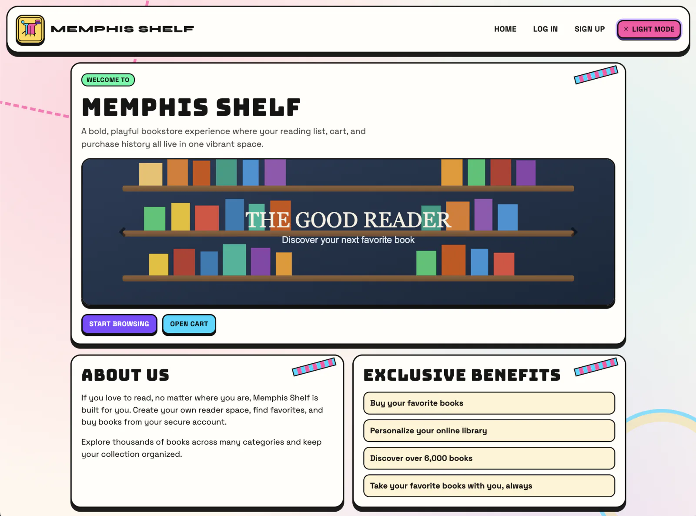

# 📚 Memphis Shelf

### Full-stack bookstore app for browsing, carting, and tracking your purchases

Memphis Shelf (The Good Reader) is a Node.js + Express web app where users can sign up, browse a seeded catalog by category, add books to a cart, and confirm purchases. It is built as a server-rendered experience with Handlebars views and a MySQL backend, with account sessions handled through Passport.

---

## ✨ Features

| | Feature | What It Does |
|---|---|---|
| 🔐 | Session-Based Auth | Sign up, log in, and keep user sessions with Passport + express-session. |
| 📚 | Category Browsing | Browse books by category and open full book details in a modal. |
| 🛒 | Cart Flow | Add books directly from browse results into a persistent user cart. |
| ✅ | Checkout Action | Convert cart items into purchases with a single confirm action. |
| 🧾 | Purchase History | View prior purchases with title, price, and formatted purchase date. |
| 🛡️ | Security Middleware | Includes CSRF protection, auth checks, rate limiting, and security headers. |

---

<p align="center">
  
</p>

---

## 🛠️ Tech Stack


---

## 🧩 Project Snapshot

- Server entrypoint: `backend/server/server.js` (Express app + Handlebars rendering + static client assets).
- Main API groups: `/api/login`, `/api/signup`, `/api/user_data`, `/api/books`, `/api/shoppingcarts`, `/api/purchases`.
- Auth & security: Passport local strategy, session cookies, CSRF token verification, per-route auth middleware, and basic login/signup rate limiting.
- Frontend pages: `/` (signup), `/login`, `/home`, `/browse`, `/cart`.
- Startup tooling: `npm run db:setup` bootstraps DB/user; startup auto-seeds books from `backend/database/books.sql` if the catalog table is empty.

---

## 🚀 Live Demo

No public deployment yet. You can run it locally 😉.

To explore other projects:

[](https://portfolio.jorgeguzman.dev/)


---

## 💻 Run it locally

Prerequisites:

- Node.js and npm
- MySQL server running locally
- `mysql` CLI available in your `PATH` (used by `npm run db:setup`)

```bash
git clone https://github.com/jorguzman100/book-shelf.git
cd book-shelf
npm install
cp .env.example .env
npm run dev
```

`npm run dev` runs `db:setup` first, then starts the server in watch mode.

Book seed data is loaded automatically on first startup if the `Books` table is empty.

Local URLs:

- App + API: `http://localhost:8090`
- Health check: `http://localhost:8090/healthz`

<details>
<summary>🔑 Required environment variables</summary>

```env
# .env
DB_HOST=localhost
DB_PORT=3306
DB_NAME=good_reader_db
DB_USER=good_reader_app
DB_PASSWORD=your_app_db_password
SESSION_SECRET=your_long_random_session_secret

# Optional
PORT=8090
NODE_ENV=development
SEQUELIZE_LOGGING=false
```
</details>

---

## 🤝 Contributors

- **Jorge Guzman**  ·  [@jorguzman100](https://github.com/jorguzman100)


