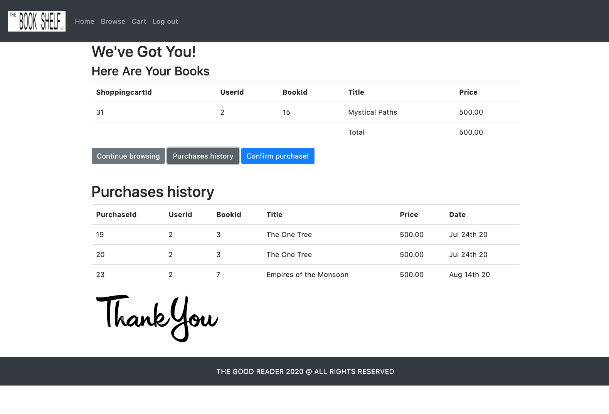

# 📚 Memphis Shelf (Book Shelf)

### A full-stack bookstore app for browsing, carting, and tracking purchases with a bold retro UI.

Memphis Shelf is a beginner-friendly full-stack web app where users can sign up, browse a large book catalog by category, add books to a cart, and keep a purchase history. It mixes classic MVC structure with a refreshed frontend style, so the project is useful to learn from and fun to use.

---

## ✨ Features

| | Feature | Why it matters |
|---|---|---|
| 🔐 | Auth with sessions + Passport | Users get protected pages and persistent login state |
| 📚 | Category-based catalog browsing | Makes a large seeded catalog easier to explore |
| 🛒 | Add-to-cart flow | Users can build a cart directly from book detail modals |
| 🧾 | Purchase history tracking | Keeps a record of confirmed purchases per user |
| 🛡️ | CSRF + security headers | Adds practical baseline protection for common web attacks |
| 🌗 | Light/Dark theme toggle | Improves UX and makes the UI feel more polished |

---

<p align="center">
  
</p>

---

## 🛠️ Tech Stack


---

## 🧩 Project Snapshot

- Express + Handlebars MVC app with Sequelize models and MySQL persistence
- Auth flow built with `passport-local`, `bcryptjs`, sessions, and a custom Sequelize session store
- Core API modules: users/auth, books, shopping carts, and purchases
- Protected pages: `/home`, `/browse`, `/cart`
- Auto DB bootstrap via `scripts/setup-db.js` and auto seed load from `books.sql` when `Books` is empty

---

## 🚀 Live Demo


[](https://github.com/jorguzman100/book-shelf)

No public deployment yet. Run it locally for now.

---

## 💻 Run it locally

```bash
git clone https://github.com/jorguzman100/book-shelf.git
cd book-shelf
npm install
cp .env.example .env
# edit .env with your local values
npm start
```

Development mode (watch server changes):

```bash
npm run dev
```

Notes:

- `npm start` and `npm run dev` run `npm run db:setup` first (`prestart` / `predev`)
- `scripts/setup-db.js` uses the `mysql` CLI, so MySQL client tools must be installed
- On first run, the app seeds books from `books.sql` if the `Books` table is empty

Local URL:

- App: `http://localhost:8090`

<details>
<summary>🔑 Required environment variables</summary>

```env
# App
NODE_ENV=development
PORT=8090
SESSION_SECRET=your_long_random_session_secret

# App DB connection (required)
DB_HOST=127.0.0.1
DB_PORT=3306
DB_NAME=good_reader_db
DB_USER=good_reader_app
DB_PASSWORD=your_app_db_password

# Optional app config
BOOK_ADMIN_EMAILS=you@example.com
DB_USER_HOST=localhost
DB_RESET_ON_START=false
DB_AUTH_PLUGIN=mysql_native_password

# Optional admin/root credentials for scripts/setup-db.js
MYSQL_ROOT_HOST=127.0.0.1
MYSQL_ROOT_PORT=3306
MYSQL_ROOT_USER=root
MYSQL_ROOT_PASSWORD=your_root_password

MYSQL_ADMIN_HOST=127.0.0.1
MYSQL_ADMIN_PORT=3306
MYSQL_ADMIN_USER=local_admin
MYSQL_ADMIN_PASSWORD=your_admin_password

# Optional test DB (falls back to DB_* values if omitted)
TEST_DB_HOST=127.0.0.1
TEST_DB_PORT=3306
TEST_DB_NAME=database_test
TEST_DB_USER=good_reader_app
TEST_DB_PASSWORD=your_test_db_password

# Production only (used when NODE_ENV=production)
JAWSDB_URL=<REDACTED_JAWSDB_URL>
```
</details>

---

## 🤝 Contributors

- **Anel Ramirez**  ·  [@AnelRaSant](https://github.com/AnelRaSant)
- **Jimena Pereda**  ·  [@JimenaPereda](https://github.com/JimenaPereda)
- **Jorge Guzman**  ·  [@jorguzman100](https://github.com/jorguzman100)
